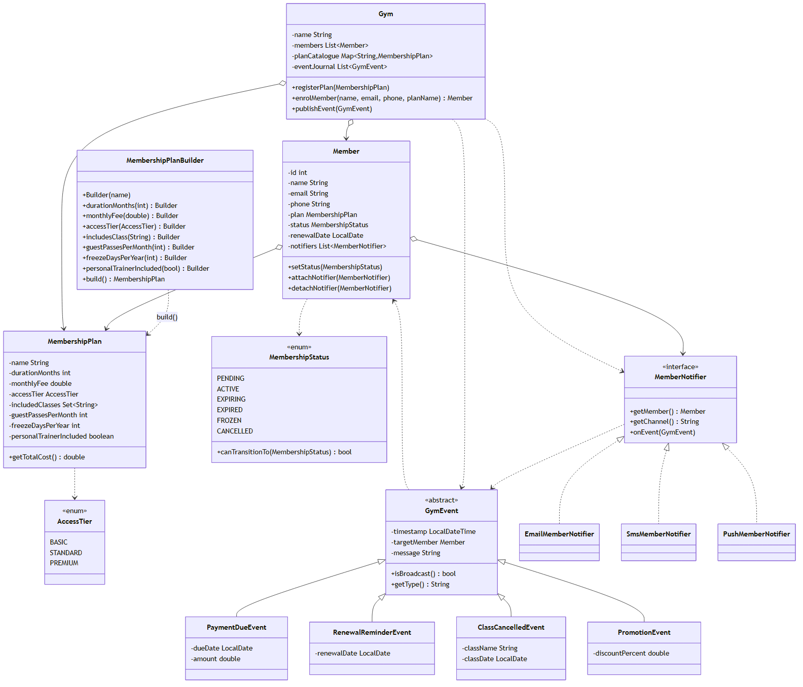

<!-- _class: title -->
<!-- _paginate: false -->

# Gym Membership<br>Management System

### A Java back-office for a gym, built around two design patterns.

<span class="meta">SEN3006</span> <span class="meta">Software Architecture</span> <span class="meta">June 2026</span>

<div class="team">

**Elif Yıldırım** &nbsp;·&nbsp; <span class="role">presenter, builder pattern, lifecycle enum</span>
**Teammate 2** &nbsp;·&nbsp; <span class="role">presenter, observer pattern, demo driver</span>

</div>

<!--
Open with: "Good morning. I'm Elif, and this is my teammate. We'll be presenting our SEN3006 project today." Take a small breath before continuing. The project is a Gym Membership Management System, written in pure Java, no external libraries at all. We chose the gym domain because two very common headaches in that business map almost one-to-one onto the patterns the course asks us to use. We are not going to spend slides defining what Builder and Observer mean, because the lecture already covered that. Instead, we want to show you the specific reasoning behind our choices, and then run a short live demo at the end. The whole thing should take about twelve minutes including questions. Then move to the agenda slide.
-->

---

<span class="pill">AGENDA</span>

## What we will cover today

| # | Topic | Who |
|---|---|---|
| 1 | The gym problem in plain English | E |
| 2 | What we actually built | E |
| 3 | Architecture, one diagram | T2 |
| 4 | Builder, and why we used it | T2 |
| 5 | Observer, and why we used it | E |
| 6 | Lifecycle as a state machine | T2 |
| 7 | Live demo | T2 drives, E narrates |
| 8 | Extending the system | E |
| 9 | SOLID, fast | E |
| 10 | Wrap up and questions | Both |

<!--
Say: "Here is the path through the next twelve minutes." Walk the audience down the column quickly, do not read every row out loud. The two slides that really matter are slides four and five, the Builder and Observer rationale. Most of the marks come from being able to explain why we picked each pattern, not just that we used them. The demo at slide seven is where we get to show that the engine actually works, and we will switch screens at that point. If we run out of time we will compress slide nine, the SOLID pass, since that is the most condensed material in the deck. Then move to the first section divider.
-->

---

<!-- _class: divider -->
<!-- _paginate: false -->

# 1. The problem

### Two things every gym back-office has to do

---

<span class="pill">PROBLEM 1 · E</span>

## Membership plans have too many fields

A plan is a name, a duration, a monthly fee, an access tier, a list of included classes, a guest-pass quota, a freeze allowance, and a personal-trainer flag. That is eight fields, and only the name is really required.

```java
// The obvious constructor is unreadable:
new MembershipPlan("Gold", 12, 49.99, PREMIUM,
    Set.of("yoga", "spin"), 2, 30, true);
```

If we add a ninth field next month, every place that creates a plan has to change. Telescoping constructors get worse with each one we add, not better.

> **Creational problem.** This is where Builder earns its place.

<!--
Say: "Picture the receptionist at a gym. A new manager walks in and says, add a Silver plan, twelve months, thirty-nine ninety-nine, standard tier, includes yoga and pilates." Read out the constructor on screen and pause, because the audience needs a second to register how unreadable it is. Tell them that most plans in real life only set three or four of those eight fields, so we end up with these long argument lists where most positions are defaults. We tried it both ways before we landed on Builder. The setter version is even worse, because it leaks a half-built plan to whoever holds the reference between calls. Then move to problem two.
-->

---

<span class="pill">PROBLEM 2 · E</span>

## Notifications fan out per member

Each member picks their own mix of email, SMS, and push. A payment-due event goes to one member's channels. A promotion goes to everyone's channels. A class cancellation can do either, depending on whether one person booked it or many did.

```java
// Without a pattern, the publishing code grows branches:
if (member.wantsEmail())  emailService.send(...);
if (member.wantsSms())    smsService.send(...);
if (member.wantsPush())   pushService.send(...);
```

Repeat that block in every event method. Add WhatsApp later, and we have to edit every call site.

> **Behavioral problem.** This is where Observer earns its place.

<!--
Say: "The second problem is about who hears what." Stress that subscriptions are per member, not gym-wide. A member who only wants SMS should not get an email just because someone else on the system did. Without Observer we end up writing this if-chain four times, once for each event type, and growing it every time marketing adds a new channel. We have all seen codebases where that block lives in twenty places and one of them got forgotten during a refactor. Mention that this is also a testing nightmare because every branch has to be exercised separately. Then hand off to T2 with: "T2 will walk through what we built." Move to divider two.
-->

---

<!-- _class: divider -->
<!-- _paginate: false -->

# 2. What we built

### One Java engine, three ways to drive it

---

<span class="pill">OVERVIEW · E</span>

## The application

**Engine.** A single `Gym` aggregator that owns members and plans, and publishes events to attached notifiers.

**How we run it (terminal, as the brief asks)**
1. `java -cp bin Main` runs six self-checking test sections from the command line.
2. `java -cp bin GymManagementApp` opens an interactive console menu in the same terminal.

**Numbers**
- 19 Java files
- 8 plan fields
- 4 event types
- 3 notifier channels
- 6 lifecycle states

<!--
Say: "Our engine is a single Gym class. It owns the catalogue of plans, the list of members, and the event journal. Around two hundred lines of code, nothing fancy." Then walk to the run instructions. The brief asks for a terminal application, so we ship two terminal entry points. The scripted Main runs the six self-checking test sections from the command line, which is the version the grader will run unattended. The GymManagementApp opens an interactive console menu in the same terminal, which is what we will drive in the live demo. Stress that both entry points hit the same Gym engine. Then hand off to T2 for the architecture diagram.
-->

---

<span class="pill">SECTION 3 · ARCHITECTURE · T2</span>

## The class diagram



<!--
Hand off to T2 with: "T2 will walk through the diagram." Three regions to point out. At the top, the Gym sits in the middle and coordinates everything. On the left, the Builder constructs immutable MembershipPlan objects. On the right, the Observer side has the MemberNotifier interface and the three concrete channels hanging off it. At the bottom sits the MembershipStatus enum, which guards the lifecycle. The thing to flag for the audience is that every arrow points towards an abstraction, not a concrete class. That is what Dependency Inversion looks like on a diagram. We will come back to that on the SOLID slide. Then move to the Builder divider.
-->

---

<!-- _class: divider -->
<!-- _paginate: false -->

# 4. Builder

### Why we picked it for `MembershipPlan`

---

<span class="pill">PATTERN · BUILDER · T2</span>

## A plan should read like a sentence, not a riddle

A `MembershipPlan` has eight fields, and most of them are optional. With an eight-argument constructor, the call site is a row of numbers and flags that nobody can decode without opening another file. With a Builder, the same call reads like the receptionist describing the plan out loud: "Gold Annual, twelve months, 49.99 a month, premium tier, includes yoga and spin, freeze allowance thirty days, personal trainer on, build it."

One more thing the chain gives us. `build()` is the single place validation runs. If anyone passes `monthlyFee(-1)`, it throws there, before any half-formed plan ever escapes into the system.

```java
MembershipPlan gold = new MembershipPlan.Builder("Gold Annual")
    .durationMonths(12)
    .monthlyFee(49.99)
    .accessTier(AccessTier.PREMIUM)
    .includesClass("yoga")
    .includesClass("spin")
    .freezeDaysPerYear(30)
    .personalTrainerIncluded(true)
    .build();
```

<!--
Say: "Read the chain top to bottom and you can hear what the plan actually is. You do not need to flip to a constructor signature to decode position three." Contrast briefly with the eight-argument constructor from slide four. The reason we want the audience to feel that contrast is that readability at the call site is the whole reason Builder exists, the rest is bookkeeping. Then make the validation point. Every rule, name not blank, fee not negative, duration positive, runs inside build(). If the professor asks why not just validate in setters, the answer is that the Builder is the gate, so we know nothing illegal can ever leave it. Then move to the design-choices comparison slide.
-->

---

<span class="pill">PATTERN · BUILDER · T2</span>

## Why a Builder, not a POJO with setters

A gym plan is a contract. If a member signs up on Gold Annual at 49.99 a month, that price must not change underneath them six months later. Setters would allow exactly that, because anyone holding a reference to the plan could rewrite its fields at any moment. Builder seals the plan after `build()` returns, so the contract stays fixed for the lifetime of the membership. That is the deciding line for us.

| Concern | Setters POJO | Builder |
|---|---|---|
| 8 optional fields | OK | OK |
| Validation lives in one place | Hard, scattered | Yes, inside `build()` |
| Plan stays immutable after creation | No, setters defeat it | Yes, no public setters |
| Partial or half-built objects can leak | Yes | No |
| Pricing can drift after signup | Yes | No |

<!--
Say: "This is the slide where the professor usually asks, why not just use Lombok at-Builder." Answer in two parts. First, the brief asks for hand-written Java with zero external dependencies, so any annotation processor is out. Second, the deeper reason is immutability. A POJO with setters lets the front-of-house staff change a member's plan price after they have already signed up, and that is a consumer-protection problem, not a code-style problem. The immutable plan plus a separate changePlan method on Member is the cleaner pattern. We also considered the static factory method approach, like MembershipPlan.gold(), but it does not scale once you have a dozen pre-defined plans. Then hand off to E for the Observer divider.
-->

---

<!-- _class: divider -->
<!-- _paginate: false -->

# 5. Observer

### Why we picked it for notifications

---

<span class="pill">PATTERN · OBSERVER · E</span>

## One line says "this happened", every channel handles itself

When a member's payment is due, the gym needs to tell them through every channel they signed up for. Without Observer, every code path that fires an event would have to remember every channel: email if they want email, SMS if they want SMS, push if they want push, repeated everywhere a notification can fire. With Observer, the business code says "this happened" once, and each channel the member has attached handles itself.

```java
// One line in business logic:
gym.publishPaymentDue(memberId, dueDate, 49.99);
```

Internally, that walks the target member's notifier list. If the member has `EmailMemberNotifier` and `SmsMemberNotifier` attached, both fire. Each one formats the message in its own voice. Email gets a full paragraph, SMS gets one line, push gets a 40-character headline. `Gym` never knows what the message looks like on any channel.

<!--
Say: "Read the call on screen. One line, gym dot publish payment due, member id, due date, amount." Then explain what we deliberately did not have to write. We did not write a chain of if-wantsEmail, if-wantsSms, if-wantsPush. The Gym walks the target member's notifier list and calls onEvent on each one. Each notifier knows its own channel, so the email notifier writes a polite paragraph, the SMS one cuts it to one line, the push one shortens it to a 40-character headline. The Gym class never imports any concrete notifier, it only knows the MemberNotifier interface. If the professor asks how this proves Dependency Inversion, that is the sentence to give him. Then move to the typed-events slide.
-->

---

<span class="pill">PATTERN · OBSERVER · E</span>

## Different events carry different things, so we typed them

Different events carry different information. A payment-due event needs an amount and a date. A class cancellation needs a class name. A promotion needs a discount percent. If we passed all of these as plain strings, the `Gym` class would have to format every message itself, which mixes domain code with presentation. Typed events let each notifier format the message in its own voice, on its own channel, without the `Gym` knowing anything about wording.

The other choice worth flagging: notifiers attach to the member, not to the `Gym`. A member who only wants SMS should not show up in another member's channel list. Targeted events walk one member's notifiers, broadcasts walk every member's in turn.

| Event | Payload | Targeting |
|---|---|---|
| `PaymentDueEvent` | amount, due date | one member |
| `RenewalReminderEvent` | renewal date | one member |
| `ClassCancelledEvent` | class name, date | one or all |
| `PromotionEvent` | discount percent | always all |

<!--
Say: "These two design choices look small in isolation, but together they are what separates Observer the pattern from Observer the mess." Take the typed-events one first because it is the easier sell. The moment marketing wanted to bold the discount percentage in the email and leave it plain in the SMS, a flat string would have made that impossible. A PromotionEvent that carries the percent as a number lets each notifier format it on its own terms. Then mention the per-member subscription point. We tried the gym-wide subscriber list first and it forced every notifier to add a member-id check before doing anything, which is a code smell. Flipping the attachment to the member removed that check entirely. Then hand off to T2 for the lifecycle divider.
-->

---

<!-- _class: divider -->
<!-- _paginate: false -->

# 6. Lifecycle

### A third pattern, almost for free

---

<span class="pill">BONUS · STATE · T2</span>

## `MembershipStatus` is its own state machine

```
PENDING ──► ACTIVE ──► EXPIRING ──► EXPIRED   (terminal)
              ▲ ▼
             FROZEN

            ACTIVE ──► CANCELLED              (terminal)
```

Each enum constant declares its own `allowedTransitions()`. `Member.setStatus(...)` checks that set and throws `IllegalArgumentException` on any illegal move.

> We get the State pattern out of a single enum file. No extra classes, no scattered conditional logic, no boolean flags to forget.

<!--
Say: "Walk one happy path with me. New signup is PENDING while we wait for the first payment to clear. Once it clears, we flip them to ACTIVE. Thirty days before renewal we move them to EXPIRING, which is the window where the system sends renewal reminders. If they pay, back to ACTIVE. If they ignore us, we move them to EXPIRED, which is terminal." Then mention the two side branches. FROZEN is for medical leave, doctors notes for an injury, that kind of thing, and a frozen member can come back to ACTIVE. CANCELLED is the early exit, and once you cancel you cannot resurrect the same membership, you have to enrol again. The enum literally refuses an illegal transition, so it is impossible to write a bug where someone goes from CANCELLED back to ACTIVE by accident. Then move to the demo divider.
-->

---

<!-- _class: divider -->
<!-- _paginate: false -->

# 7. Live demo

### About three minutes, on the laptop

---

<span class="pill">DEMO · T2 drives, E narrates</span>

## What we will show (all in the terminal)

1. **Scripted self-checks.** `java -cp bin Main`. Six test sections run, each printing one `[PASS]`. Pause on Section 6, where one published event prints three differently formatted messages, one per channel.
2. **Interactive console.** `java -cp bin GymManagementApp`. Open the menu, register a plan, enrol a member, attach Email and SMS.
3. **Trigger Builder validation.** Choose "create plan", set `monthlyFee` to `-1`. The engine throws, the console prints the exact reason.
4. **Trigger Observer fan-out.** Publish a payment-due event. Two notifier lines print to the console for the one member, one for Email, one for SMS.
5. **Trigger an illegal transition.** Try moving a `CANCELLED` member back to `ACTIVE`. The engine refuses with the exact reason.

<!--
Say: "T2 will run the demo in the terminal. I will narrate so you know what to watch for." The five steps stay inside the terminal because the brief asks for a terminal application, and that is what we want the grader to see. The single most important moment is step three. When the validation throws, notice that the message comes from the Gym engine, not from the console driver. The console is just printing what the engine threw. That is the separation-of-concerns claim from earlier, and the demo is the live proof of it. Keep the steps tight: roughly thirty seconds each, about three minutes total. If we hit a snag mid-demo, switch to step five and come back. Then move to the extension divider.
-->

---

<!-- _class: divider -->
<!-- _paginate: false -->

# 8. Extending it

### What changes if you add a channel, event, or field

---

<span class="pill">EXTENSION · E</span>

## Three "what if" cases

<div class="grid2">

<div>

**Add a WhatsApp channel**
```java
class WhatsAppMemberNotifier
    implements MemberNotifier { ... }

member.attachNotifier(
    new WhatsAppMemberNotifier(...));
```
Zero edits to Gym, to events, or to existing notifiers.

**Add a `MemberBirthdayEvent`**
```java
class MemberBirthdayEvent
    extends GymEvent { ... }

gym.publishEvent(
    new MemberBirthdayEvent(member));
```
Zero edits to existing events.

</div>

<div>

**Add `lockerIncluded` to plans**
```java
// MembershipPlan: 1 field + 1 accessor
// MembershipPlan.Builder: 1 setter
```
The Builder absorbs the change in one place. No other class touches it.

**Why this matters**

- Open/Closed in concrete file counts, not theory.
- New features without touching tested code.
- Test 5 in `Main.java` proves this at runtime by installing a brand-new anonymous notifier while the program is already running.

</div>

</div>

<!--
Say: "These are the three extension cases the professor will likely ask about, so we want to answer them before he does." Pick one of the three code blocks and walk through it slowly. The WhatsApp one is the strongest example because it touches zero existing files, just adds one new class and calls attach. The birthday event is similar. The locker field is the only one that modifies an existing file, but it modifies it in exactly two places, the data class and its builder, never a call site. Then mention the Test 5 trick: at runtime, we register an anonymous MemberNotifier inside the main method, and from that point on it receives every event. That is the strongest possible demonstration of Open/Closed, because the program is literally extending itself while running. Then move to the SOLID slide.
-->

---

<span class="pill">SOLID · fast · E</span>

## How the design lines up with SOLID

- **S, Single Responsibility.** The `Gym` coordinates only. Builders build, notifiers render, events carry data.
- **O, Open/Closed.** New channel, new event, new plan field. None of them edit existing code.
- **L, Liskov.** Every notifier and event subclass can stand in for its abstraction without surprises.
- **I, Interface Segregation.** `MemberNotifier` has three short methods, and every implementation uses all three.
- **D, Dependency Inversion.** The `Gym` references only abstractions. There is no `new EmailMemberNotifier(...)` anywhere inside `Gym`.

<!--
Say: "Ten seconds per principle. I am not going to dwell." Read each line as a single sentence and move on. If the professor wants a deeper answer on any one of them, we have it in the report. The two principles he is most likely to probe are Open/Closed, which we just covered on the extension slide, and Dependency Inversion, which the architecture diagram already showed visually. If we are running long, this is the slide to compress, because the same content is in the report and the design spec. Then move to the wrap-up divider.
-->

---

<!-- _class: divider -->
<!-- _paginate: false -->

# 9. Wrapping up

### What worked, and what we would do next

---

<span class="pill">REFLECTION · Both</span>

## Honest reflection

<div class="grid2">

<div>

**What worked**

- Builder kept the call sites readable and the plans immutable.
- Observer with typed events kept the `Gym` free of presentation logic.
- The lifecycle enum gave us a small state machine without writing a new class.
- The scripted `Main` doubled as our test harness without bringing in JUnit.

</div>

<div>

**What we would do next**

- Persistence. Right now everything lives in memory and dies with the JVM.
- Async notifier dispatch. The current fan-out is synchronous, so a slow channel blocks the rest.
- Bulk batching for promotions, since today every member triggers a separate walk.
- A small REST layer on top, reusing the same engine.

</div>

</div>

<!--
Say: "We want to be honest about scope. This is a teaching project, not production software." The left column is what we are proud of. The right column is what we would build if the deadline were two weeks later. Persistence is the obvious next step, because everything currently dies with the JVM. Async dispatch matters because right now a slow SMS gateway would block every other channel for the same event. The REST layer is interesting because it would be a fourth entry point that drives the same engine, which would prove the engine really is presentation-agnostic. We are not apologising for these gaps, they are deliberate scope decisions, not bugs. Then move to the closing slide.
-->

---

<!-- _class: title -->
<!-- _paginate: false -->

# Questions?

### Thank you for listening.

<span class="meta">github.com/hoop-ai/gym-membership-management-system</span>

<div class="team">

**Elif Yıldırım** &nbsp;&nbsp;&nbsp; **Teammate 2**

</div>

<!--
Say: "Thank you. We are happy to take questions." Field questions in pairs. T2 takes anything about Builder, the lifecycle enum, or the architecture diagram. I take Observer, the domain logic, SOLID, and the extension cases. If a question hits both of our areas, whoever wrote that piece of code answers first and the other one adds context. The most common questions we have rehearsed for are: why Builder over Lombok, why notifiers per member instead of per gym, how the lifecycle enum compares to a full State pattern with classes, and what the next step would be if this were a real product. If we get a question we have not prepared for, take a breath, repeat it back to the professor in our own words to make sure we understood, and then answer plainly without guessing. End the session by thanking the professor again.
-->
