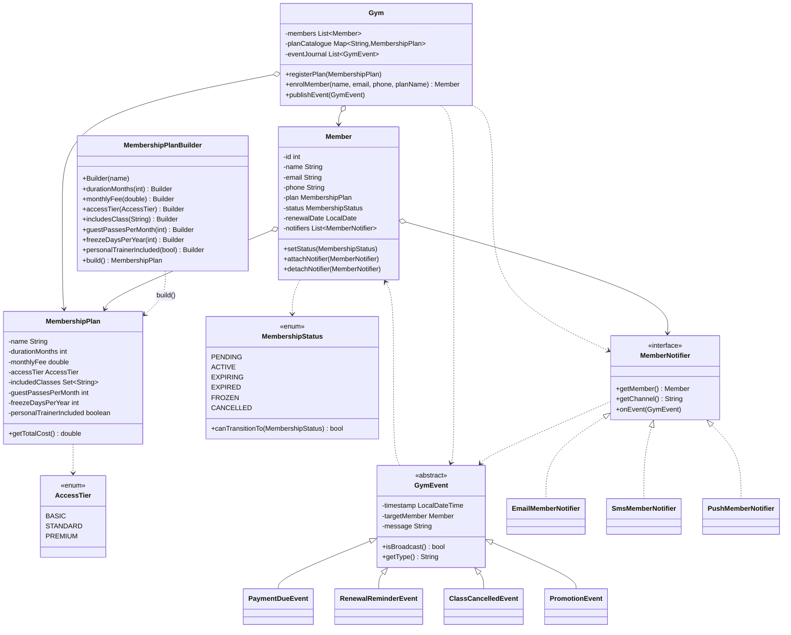
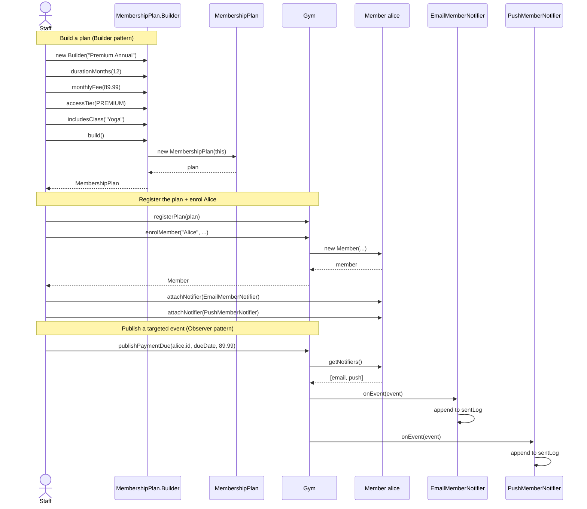
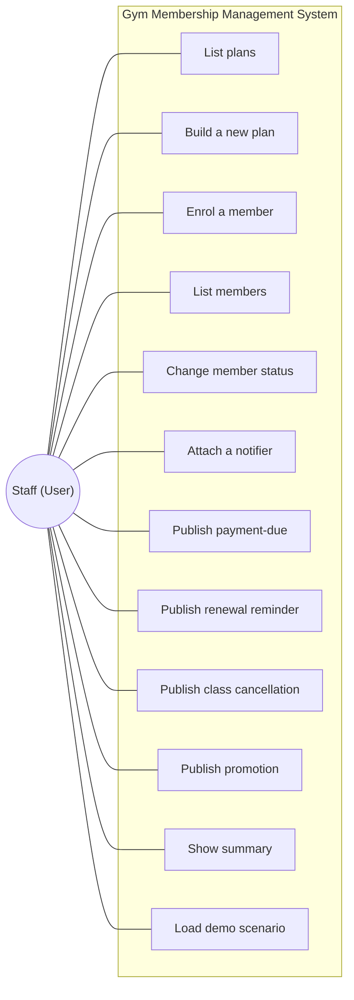
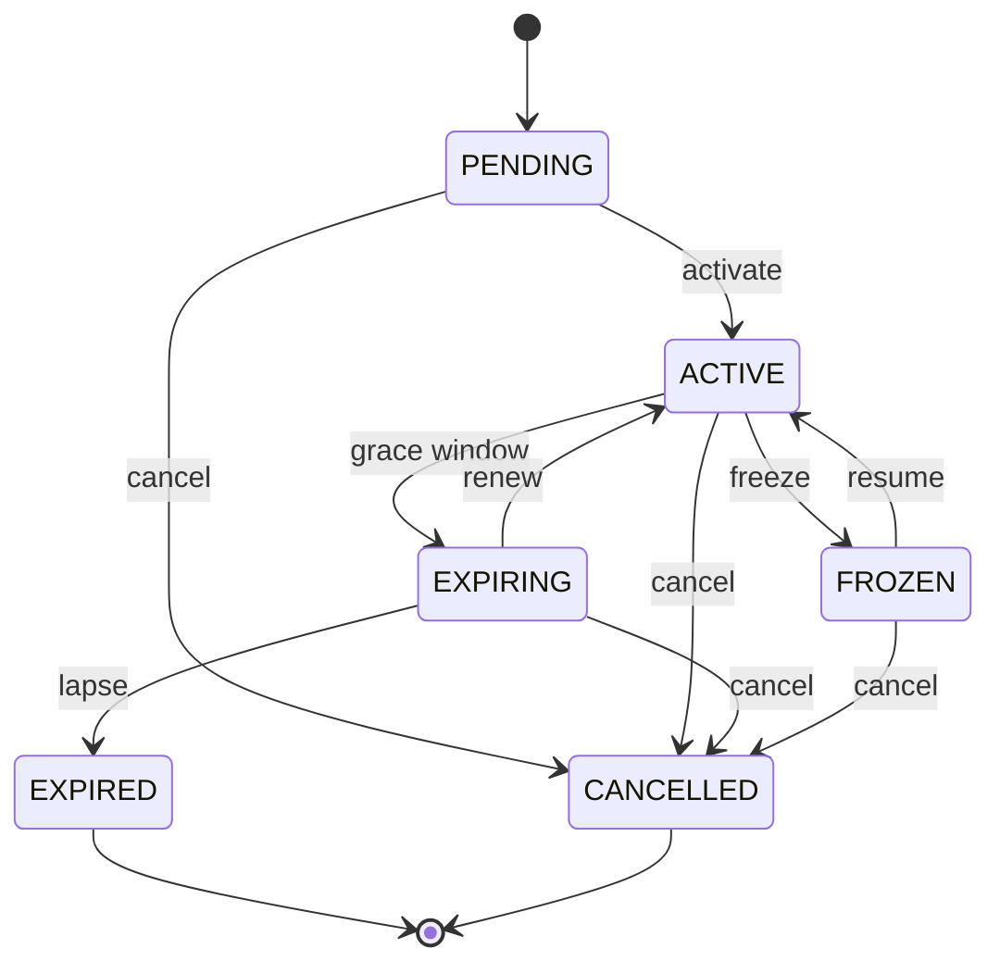
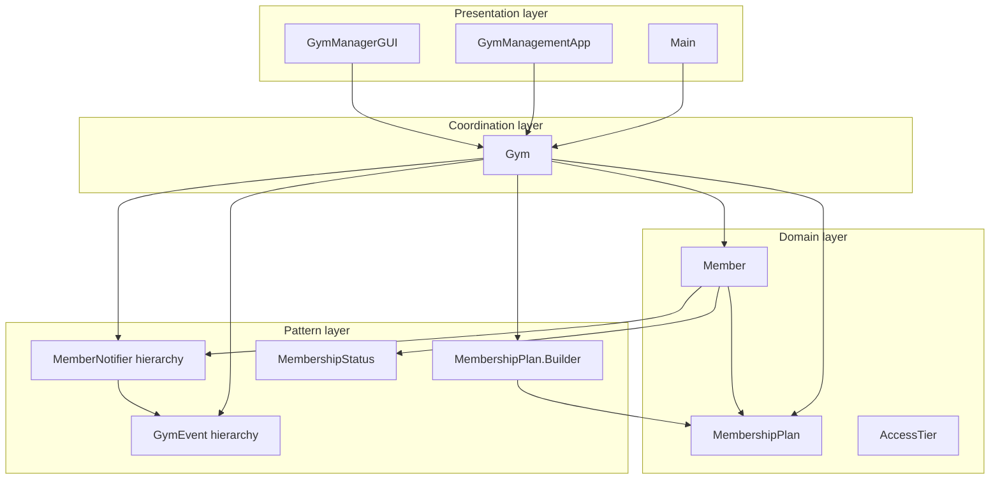
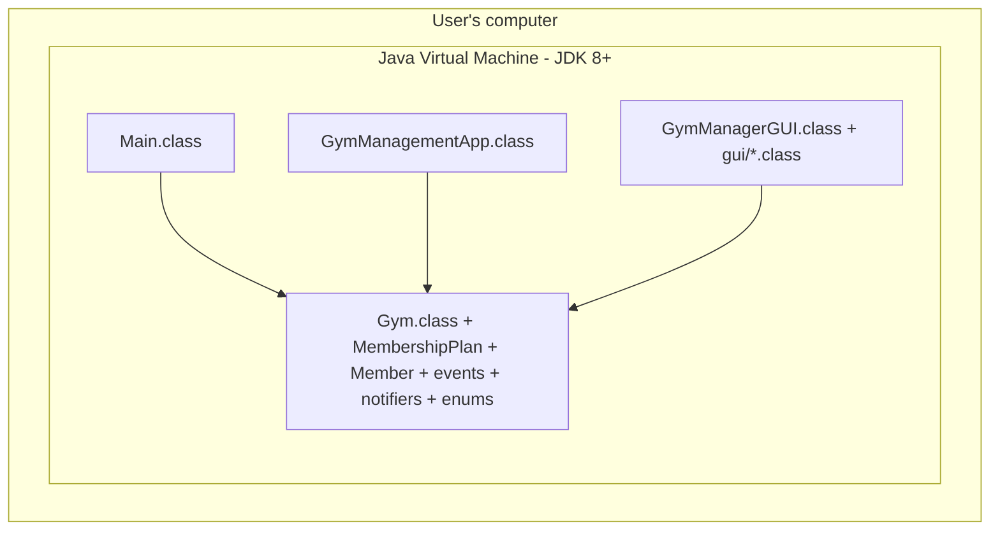

# Gym Membership Management System

## Design Patterns: Builder and Observer

**Course:** SEN3006 -- Software Architecture
**Project type:** Java Design Pattern Project
**Language:** Java 8 (pure standard library, zero external dependencies)
**Source files:** 19 (1 abstract event class, 4 concrete events, 1 notifier interface, 3 concrete notifiers, 2 enums, Member, MembershipPlan + nested Builder, Gym, 2 non-GUI entry points, 5 GUI classes)
**Deliverables:** Java source ZIP, compiled JAR, PDF report

---

## Table of Contents

1. [Introduction](#31-introduction)
2. [Problem Definition and System Requirements](#32-problem-definition-and-system-requirements)
3. [Design Pattern Explanation](#33-design-pattern-explanation)
4. [System Design and UML Diagrams (Mandatory)](#34-system-design-and-uml-diagrams-mandatory)
5. [Implementation (Code Explanation)](#35-implementation-code-explanation)
6. [Testing and Demonstration](#36-testing-and-demonstration)
7. [Results and Evaluation](#37-results-and-evaluation)
8. [Conclusion](#38-conclusion)
9. [References](#39-references)

---

## 3.1 Introduction

### Background

A modern gym is, from a software point of view, the intersection of two
recurring complexity sources. The first is **product variability** -- a
gym offers many subtly different membership plans (monthly vs annual,
basic vs premium, with or without group classes, with or without freeze
allowances, with or without personal training), and these plans differ
along many dimensions rather than along a single "type" axis. The second
is **communication fan-out** -- a gym must reach members through
whichever channels they have opted into (email, SMS, push, perhaps
in-app notifications), and the same internal event may need to be
formatted very differently for each channel.

Treated naively, these complexities pile up fast. Plan construction
gravitates toward constructors with seven or eight positional
parameters, or toward a sprawling factory that knows the rules for every
variant. Notification logic gravitates toward `if (channel == "email")
... else if (channel == "sms") ...` chains buried inside the business
logic, and every new channel becomes a code-review-wide change.

Both problems have textbook design-pattern solutions: the **Builder**
pattern for constructing objects with many configurable attributes, and
the **Observer** pattern for fanning a single event out to a set of
interested subscribers. This project implements a complete gym
membership management application that applies both patterns to a
real, working system that demonstrates the patterns' value visibly --
in scripted tests, in a console driver, and in a Swing GUI that lights
up a live event log every time a notification is published.

### Motivation

In an introductory architecture course the goal is not to ship a real
SaaS product; it is to make pattern theory tangible. A gym membership
system is well-suited to that goal because **the value of each pattern
is immediately visible at the call site**. A `MembershipPlan.Builder`
chain reads like a configuration list. An `EmailMemberNotifier` attached
to a `Member` produces a printed message the very next time the gym
publishes an event for that member. The patterns are not buried in
infrastructure; they show up in the demo output and the GUI log.

### Objectives

1. **Demonstrate the Builder pattern** by constructing immutable
   {@link MembershipPlan} instances with many optional, validated
   attributes via a fluent inner class.
2. **Demonstrate the Observer pattern** by publishing typed
   {@link GymEvent} instances from a single `Gym` subject to a
   per-member set of `MemberNotifier` observers.
3. **Apply SOLID principles** throughout the design so the system is
   maintainable, extensible, and testable -- in particular,
   demonstrating Open/Closed live in the scripted test.
4. **Build a complete, working system** in pure Java with zero
   external dependencies, proving that good architecture does not
   require frameworks.

### Solution overview

The Gym Membership Management System has three architectural layers.
The **domain layer** holds `Member`, `MembershipPlan` (with its nested
`Builder`), `MembershipStatus`, and `AccessTier`. The **pattern layer**
holds the Observer fabric (`GymEvent` and its four subclasses,
`MemberNotifier` and its three concrete implementations) plus the
Builder's nested class. The **coordination + presentation layer** holds
the `Gym` class -- the single point of publication for every event --
and the three entry points: `Main` (scripted demo), `GymManagementApp`
(console menu), and `gui.GymManagerGUI` (Swing GUI). All three
front-ends share the same engine; the patterns sit in the engine, not
in the GUI.

---

## 3.2 Problem Definition and System Requirements

### Problem statement

Build a gym membership management application that lets staff
(1) define many distinct membership plans without proliferating
constructors or factories, (2) enrol members against those plans,
(3) move members through the natural membership lifecycle, and
(4) notify members about gym events on whichever channel each member
has subscribed to. The design must allow new plan attributes, new
notification channels, and new event kinds to be added without
modifying any existing class.

### Functional requirements

| ID  | Requirement | Demonstrated by |
|-----|-------------|-----------------|
| FR1 | The system must support membership plans with at least seven configurable attributes (name, duration, price, access tier, included classes, guest passes, freeze days, personal-training flag). | `MembershipPlan` + `MembershipPlan.Builder`. |
| FR2 | Plans must be immutable once constructed; mutation is not allowed. | `MembershipPlan` fields are `private final`. |
| FR3 | Members must be enrollable against a registered plan and identifiable by an auto-generated ID. | `Gym.enrolMember`, `AbstractRecipe`-style ID counter on `Member`. |
| FR4 | Each member must transition through a lifecycle with rules that prevent invalid transitions. | `MembershipStatus` enum + `Member.setStatus` validation. |
| FR5 | The system must publish at least four event kinds (payment due, renewal reminder, class cancellation, promotion). Both targeted and broadcast events must be supported. | `GymEvent` and the four concrete subclasses; `Gym.publishEvent`. |
| FR6 | Each member must be able to subscribe to one or more notification channels (email, SMS, push, ...). Adding a new channel must not require touching the gym or other channels. | `MemberNotifier` interface; three concrete classes; `Member.attachNotifier`. |
| FR7 | The system must offer at least three entry points: a scripted test demo, a console menu, and a GUI. | `Main`, `GymManagementApp`, `gui.GymManagerGUI`. |

### Non-functional requirements

| ID   | Requirement | Approach |
|------|-------------|----------|
| NFR1 | Zero external dependencies. | Only `java.util.*`, `java.time.*`, `javax.swing.*`, `java.awt.*`. |
| NFR2 | Build with a single `javac` command on Java 8+. | Default package; no Maven, Gradle, or build descriptor. |
| NFR3 | Add a new plan attribute, a new notifier channel, or a new event kind without modifying any existing class. | All extension points are abstract; `Gym.publishEvent` dispatches by polymorphism. |
| NFR4 | Errors are surfaced with actionable messages, not stack traces. | Validation in builders, constructors, and setters throws `IllegalArgumentException`. |
| NFR5 | The system must be testable without a test framework. | `Main.java` contains six self-checking sections with `[PASS]` markers. |
| NFR6 | The GUI must be readable on Windows, macOS, and Linux. | Custom table-header renderer and Metal-styled accent buttons override platform L&F where it would otherwise hide background colours. |

### Why architecture matters

Without the patterns described in section 3.3, a fourth membership
plan attribute or a fourth notification channel would touch every
caller, every conditional, and every test. With the patterns in place
these changes are local: a new `MembershipPlan.Builder` setter or a new
class implementing `MemberNotifier`. NFR3 is the explicit form of this
guarantee, and Test 5 in `Main.java` proves it at runtime by attaching
a brand-new anonymous notifier without recompiling the engine.

---

## 3.3 Design Pattern Explanation

### 3.3.1 Builder Pattern (Creational)

#### Definition

The Builder pattern, as introduced by Gamma et al. (1994), "separates
the construction of a complex object from its representation so that
the same construction process can create different representations".
In its modern Java form (popularised by Bloch's *Effective Java*) the
emphasis shifts slightly: the Builder is a fluent inner class that
collects parameters one at a time and then validates them centrally in
a final `build()` call that returns an immutable Product.

#### When and why it is used

Use the Builder pattern when:

- A class has many constructor parameters (Bloch's heuristic: three or
  more, especially if several are optional).
- Several parameters are optional and the call site should not have to
  pass `null` or zero for them.
- The object must be immutable after construction.
- Validation rules cross multiple parameters and should run in a
  single, well-defined place.

`MembershipPlan` ticks every box: eight attributes, several optional,
required immutability, cross-field validation (`durationMonths` must be
positive, `monthlyFee` must be non-negative, `accessTier` must be set,
etc.).

#### Advantages

- **Readable call sites.** Configuration looks vertical, not positional.
- **Immutable product.** Once built, plans cannot drift; references can
  be shared freely.
- **Centralised validation.** Every plan that exists has been validated
  by the same routine.
- **Open/Closed for new attributes.** Adding a ninth attribute means
  one new field on `MembershipPlan`, one new method on `Builder`, and
  no changes to the call sites that do not need the new attribute.

#### Why suitable for this project

The assignment requires demonstrable extensibility for plan attributes.
Builder makes that property structural rather than aspirational:
extending the plan with a new field changes only the plan and the
builder, never any caller. The pattern also makes the code at the
demo's call site readable enough to put on a presentation slide.

#### Real-world example

`java.lang.StringBuilder` is the JDK's canonical Builder. More
contemporary examples include `HttpRequest.Builder` (JDK 11+),
`Stream.Builder` (JDK 8+), and almost every fluent API in Spring's
configuration layer.

### 3.3.2 Observer Pattern (Behavioral)

#### Definition

The Observer pattern "defines a one-to-many dependency between objects
so that when one object changes state, all its dependents are notified
and updated automatically" (Gamma et al., 1994). A Subject maintains a
list of Observers and exposes a method (`attach`, `subscribe`,
`addObserver`, ...) to register new ones; when the Subject's state
changes, it walks the list and calls each Observer's `update` method.

#### When and why it is used

Use the Observer pattern when:

- An abstraction has two aspects, one dependent on the other.
- A change to one object requires changing others, and you do not know
  in advance how many objects need to change.
- An object should be able to notify other objects without making
  assumptions about who those objects are.

The gym fits exactly: a single internal change (e.g., recognising that
a payment is due) needs to reach an unknown set of subscribed channels
for the affected member. The gym should not have to encode the cross
product of (event kind) x (channel) anywhere.

#### Advantages

- **Loose coupling.** The Subject knows the Observer interface only.
- **Runtime subscription.** Observers attach and detach dynamically.
- **Broadcast vs targeted, uniformly.** Both cases use the same
  publish call; the Subject decides who is in scope.
- **Open/Closed.** A new channel is a new Observer class. The Subject
  is untouched.

#### Why suitable for this project

The four event kinds and three channels in this system produce a 12-cell
matrix in a naive design. Observer collapses that matrix into 4 + 3
classes, with the `Gym` class as the single point of dispatch. The
GUI's notification log strip makes the pattern visible -- every event
emitted by the engine becomes a printed line in the dark log at the
bottom of the window.

#### Real-world example

`java.util.Observer` / `java.util.Observable` were the JDK's textbook
implementations (deprecated in JDK 9 in favour of more modern
abstractions). Swing's `ActionListener`, `PropertyChangeListener`, and
`TableModelListener` are all Observer implementations. Reactive
streams (`Flow.Subscriber` in JDK 9+) are a generalised Observer.

---

## 3.4 System Design and UML Diagrams (Mandatory)

The system is organised in three logical layers:

1. **Domain layer** -- `Member`, `MembershipPlan` (with nested `Builder`),
   `MembershipStatus` enum, `AccessTier` enum.
2. **Pattern layer** -- `GymEvent` abstract class and four concrete events
   (`PaymentDueEvent`, `RenewalReminderEvent`, `ClassCancelledEvent`,
   `PromotionEvent`); `MemberNotifier` interface and three concrete
   implementations (`EmailMemberNotifier`, `SmsMemberNotifier`,
   `PushMemberNotifier`).
3. **Coordination + presentation layer** -- `Gym` (the single coordinator),
   `Main` (scripted demo), `GymManagementApp` (console menu), and the
   five-file Swing GUI under `gui/`.

### 3.4.1 Class Diagram (mandatory)

The class diagram below renders the engine in three vertical bands.
Builder-side classes (`MembershipPlan` and its nested `Builder`) live
on the left; Observer-side classes (`GymEvent` + four subclasses,
`MemberNotifier` + three implementations) live in the middle; the
`Gym` coordinator sits on the right and holds references *only* to
abstractions, never to concrete event or notifier classes. The two
enums (`MembershipStatus` for the lifecycle state machine and
`AccessTier` for the privilege ladder) sit alongside `Member` and
`MembershipPlan` respectively.



**Detailed explanation.** Three structural facts are worth reading off
the diagram. (1) The hollow-diamond aggregation arrow from `Member` to
`MemberNotifier` is what makes Observer subscriptions belong to *the
member*, not to the gym; this is the design decision that lets two
members opt into completely different channel mixes. (2) The dashed
dependency arrow from `MembershipPlanBuilder` to `MembershipPlan`
(labelled `build()`) is the Builder pattern's contract: nothing else
in the system instantiates `MembershipPlan`. The private constructor
on `MembershipPlan` enforces this at compile time. (3) Every arrow
that touches `Gym` points to an abstraction (`Member`,
`MembershipPlan`, `GymEvent`, `MemberNotifier`) -- the Dependency
Inversion Principle becomes a visual property of the diagram, not a
written claim.

The PlantUML source -- with the same content rendered in PlantUML
syntax for tool interoperability -- is available at
[docs/uml/class/gym-management-class.puml](../uml/class/gym-management-class.puml).

### 3.4.2 Sequence Diagram (mandatory)

The sequence diagram below renders the two principal flows: building
a plan via the Builder and then publishing a targeted event through
the Observer fabric. The horizontal columns are lifelines for each
collaborating object; arrows show synchronous method calls; the
`Note over` bars mark the boundary between the two flows.



**Detailed explanation.** The Builder flow shows the fluent assembly
explicitly: the staff calls one configuration method per attribute on
the same `Builder` instance, and the final `build()` call returns an
immutable `MembershipPlan`. Notice that the staff never instantiates
`MembershipPlan` directly -- the constructor is private and only the
Builder may call it. The Observer flow shows the dispatch mechanics:
one `publishPaymentDue(...)` call on the `Gym` results in
`onEvent(event)` being called on **every** notifier attached to Alice,
in attachment order. The notifier internals (`append to sentLog`) are
shown to make the side effect explicit -- this is what the test demo
asserts on and what the GUI's log strip reads from.

If Alice had attached three notifiers instead of two, three lifelines
would appear in the third section and three `onEvent` arrows would
fan out. If the event were a broadcast (a `PromotionEvent` for
example), the `Gym` would instead loop over every member and over
each of their notifiers -- the same `onEvent` arrow but a much wider
fan-out.

The PlantUML source is at
[docs/uml/sequence/publish-event-sequence.puml](../uml/sequence/publish-event-sequence.puml).

### 3.4.3 Use Case Diagram (mandatory)

The use-case diagram enumerates every operation a gym staffer can
trigger through any of the three entry points. All twelve use cases
are reachable from `Main`, `GymManagementApp`, and `gui.GymManagerGUI`
-- because all three drive the same `Gym` public API.



**Detailed explanation.** The use cases cluster into four functional
groups that map cleanly onto the patterns:

- **Plan management** (UC1, UC2) exercises the Builder. UC2 in
  particular walks the staff through every Builder setter in turn --
  the console driver renders this as eleven prompts.
- **Member management** (UC3, UC4, UC5) covers enrolment, listing,
  and lifecycle transitions. UC5 is validated by the
  `MembershipStatus` state machine; invalid transitions are
  rejected.
- **Notification subscriptions** (UC6) attaches an Observer to a
  specific member. The same member can hold multiple notifiers.
- **Event publication** (UC7-UC10) drives the Observer pattern.
  UC7 and UC8 are targeted (single member); UC9 is broadcastable
  (defaults to broadcast); UC10 is always a broadcast.
- **Reporting** (UC11, UC12) supports the demos.

The PlantUML source is at
[docs/uml/usecase/gym-management-usecase.puml](../uml/usecase/gym-management-usecase.puml).

### 3.4.4 State Diagram (optional, recommended)

The membership lifecycle is a state machine encoded directly in the
`MembershipStatus` enum -- each constant declares its allowed
successors via `allowedTransitions()`, and `Member.setStatus(...)`
consults that set before applying the change. Six states, nine
edges, two terminal states.



**Detailed explanation.** Two transitions deserve commentary. The
`EXPIRING -> ACTIVE` edge marks a renewal: `Member.setStatus(ACTIVE)`
detects the previous state was `EXPIRING` and pushes the renewal date
forward by the plan's duration in months. The `FROZEN -> ACTIVE` edge
behaves identically for a resume from a freeze. Both back-edges to
`ACTIVE` therefore have a side effect on the member's renewal date --
modelled in code, not just on paper. The two terminal states
(`EXPIRED`, `CANCELLED`) return an empty allowed-set; any attempt to
move out of them is rejected.

### 3.4.5 Activity Diagram (optional, recommended)

The activity diagram in
[docs/uml/activity/activity-diagram.md](../uml/activity/activity-diagram.md)
shows the same lifecycle in workflow form: from "Staff builds plan"
through enrolment, optional freeze and renewal loops, and finally
either `EXPIRED` or `CANCELLED`. The Mermaid render in that file maps
each activity step to a concrete method call on `Gym` or `Member`.

### 3.4.6 Component Diagram (optional)

Four logical layers run inside one JVM:



**Detailed explanation.** Every arrow points *toward* an abstraction
or the domain. The Presentation layer never reaches past the
Coordination layer -- a GUI change cannot break the engine. Adding a
new presentation (REST, mobile) is one new box with one arrow into
the `Gym`.

### 3.4.7 Deployment Diagram (optional)

The whole system runs inside one JVM:



**Detailed explanation.** One process, one JVM, zero remote
dependencies. The three entry points are siblings linking the same
engine classes; choosing one does not exclude the others. There is no
network, no database, no external service -- intentional, given the
assignment's mandate of "pure Java with the standard library".

---

## 3.5 Implementation (Code Explanation)

### The Product hierarchy (Builder side)

`MembershipPlan` is a final class with eight private-final fields and
no setters -- once built, a plan is immutable. The nested
`MembershipPlan.Builder` is a static inner class that holds a working
copy of every attribute, exposes one fluent setter per attribute, and
validates the entire set inside `build()`. The constructor is private;
only the Builder can construct plans.

The decision to nest the Builder inside `MembershipPlan` is deliberate.
It keeps the Product and the Builder in one file, avoids exposing the
private constructor, and signals the relationship in the type name
(`MembershipPlan.Builder`). The pattern reads identically to
`StringBuilder` / `String`, `HttpRequest.Builder` / `HttpRequest`, and
the many other examples in the JDK.

### Member and the lifecycle

`Member` holds the universal member data (id, name, email, phone, join
timestamp, current plan, status, renewal date) plus a list of attached
`MemberNotifier` instances. `setStatus(...)` consults
`MembershipStatus.canTransitionTo(...)` and throws
`IllegalArgumentException` if the transition is not allowed. Side
effect: when moving back to `ACTIVE` from `EXPIRING` (a renewal) or
from `FROZEN` (a resume), the renewal date is pushed forward by the
plan duration.

### The event hierarchy (Observer side)

`GymEvent` is an abstract base class with three universal fields
(`timestamp`, `targetMember`, `message`). Four concrete subclasses add
the type-specific data they need: `PaymentDueEvent` (date + amount),
`RenewalReminderEvent` (renewal date), `ClassCancelledEvent` (class
name + class date, broadcastable), `PromotionEvent` (discount percent,
always a broadcast).

`isBroadcast()` returns `true` when `targetMember` is null. The `Gym`
uses this flag to choose between "iterate the target's notifiers" and
"iterate every member's notifiers".

### The Observer hierarchy

`MemberNotifier` is a three-method interface: `getMember()`,
`getChannel()`, and `onEvent(GymEvent)`. Each concrete implementation
wraps one member and one channel. `onEvent` is responsible for
ignoring events that target a different member -- broadcasts are
delivered to every attached notifier.

Each concrete notifier also keeps an internal `sentLog` of every
formatted message it has emitted. The log is what the test demo and the
GUI read to prove that the Observer pattern actually delivered the
event -- nothing is faked, every line in the log corresponds to a real
call to `onEvent`.

### The coordinator

`Gym` is the single class that ties everything together. It owns the
plan catalogue (built outside via the Builder), the member list, and
the chronological event journal. The two key methods are
`registerPlan(MembershipPlan)` (Builder consumer) and
`publishEvent(GymEvent)` (Observer subject). Both methods touch only
abstractions -- `Gym` never references `EmailMemberNotifier` or
`PaymentDueEvent` directly.

### The three entry points

- `Main.java` runs six labelled test sections that exercise both
  patterns, the lifecycle, and six edge cases, printing `[PASS]` for
  each successful check.
- `GymManagementApp.java` offers a console menu so a non-graphical
  demo can drive every public API call.
- `gui.GymManagerGUI` opens a Swing window. The member table on the
  left is bound to `Gym.getAllMembers()`. The enrolment form on the
  right pulls plan names from `Gym.getAllPlans()`. The lifecycle and
  notification buttons at the bottom call the matching
  `Gym.changeMemberStatus` and `Gym.publish*` methods. The dark log
  strip at the very bottom records every event the gym publishes,
  rendered identically to the messages each notifier produces.

---

## 3.6 Testing and Demonstration

### Test methodology

The project uses a lightweight, framework-free testing approach.
`Main.java` contains six self-checking sections, each of which prints a
clearly-labelled `[PASS]` line on success and a `FAIL` line on failure.
This style is appropriate for a classroom project where the goal is a
visible, presentable demonstration rather than an industrial test
pipeline.

| Test | Verifies |
|------|----------|
| 1 -- Builder demo | Three distinct plans built via fluent chains; each is immutable; the basic plan uses defaults, the premium plan exercises every optional attribute. |
| 2 -- Observer demo | A targeted event reaches only the affected member's notifiers; broadcast events reach every attached notifier across the gym; channel-specific formatting is applied. Assertions on the per-notifier `sentLog` sizes confirm correct delivery counts. |
| 3 -- Lifecycle demo | Every allowed `MembershipStatus` transition succeeds; every disallowed transition throws `IllegalArgumentException`; terminal states (`EXPIRED`, `CANCELLED`) reject every onward transition. |
| 4 -- Integration demo | A full workflow -- register plans (Builder), enrol members, attach notifiers, walk the lifecycle, publish targeted and broadcast events, summarise. |
| 5 -- SOLID demo | A brand-new `MemberNotifier` (defined inline as an anonymous class) is attached to a member at runtime, and the next published event reaches it. Open/Closed and Dependency Inversion are exercised live. |
| 6 -- Edge cases | Six guarded failure modes: builder rejects blank name, builder rejects zero duration, gym rejects unknown plan name, gym rejects unknown member ID, notifier ignores events for other members, detach stops further delivery. |

### How to run

```sh
javac -d bin src/main/java/*.java src/main/java/gui/*.java
java -cp bin Main
```

The program ends with `ALL TESTS PASSED`. Detailed test documentation
is in
[docs/design/test-documentation.md](../design/test-documentation.md).

### Example inputs and outputs

The scripted demo is hermetic -- it takes no input from the user, and
produces a deterministic transcript. The transcript begins with a
banner identifying the system and the patterns, then prints six
labelled test sections, and ends with `ALL TESTS PASSED` when every
check is green. An abridged transcript appears below; the complete
output is several screens long.

```
##########################################################
#                                                        #
#    SEN3006 -- Gym Membership Management System Demo    #
#         Builder  +  Observer  (pure Java)              #
#                                                        #
##########################################################

==========================================================
  TEST 1: Builder Pattern Demo
==========================================================
  Plan[name='Basic Monthly',       tier=BASIC,    months=1,  monthlyFee=29.99, ...]
  Plan[name='Standard Six-Month',  tier=STANDARD, months=6,  monthlyFee=49.99, ...]
  Plan[name='Premium Annual',      tier=PREMIUM,  months=12, monthlyFee=89.99, ...]
  Premium total cost over 12 months: 1079.88
[PASS] Builder produced three distinct, immutable plans.

==========================================================
  TEST 2: Observer Pattern Demo
==========================================================
  ---- Targeted payment-due event for Alice ----
[EMAIL -> alice@example.com] (PAYMENT_DUE) Payment of 89.99 is due on 2026-05-28.
[PUSH  -> Alice Aydin]       Payment reminder | Payment of 89.99 is due on 2026-05-28.

  ---- Broadcast: class cancellation ----
[EMAIL -> alice@example.com] (CLASS_CANCELLED) The Spinning class scheduled for ...
[PUSH  -> Alice Aydin]       Class update | The Spinning class scheduled for ...
[SMS   -> +90-555-0002]      (CLASS_CANCELLED) The Spinning class scheduled for ...
[EMAIL -> chloe@example.com] (CLASS_CANCELLED) The Spinning class scheduled for ...
[SMS   -> +90-555-0003]      (CLASS_CANCELLED) The Spinning class scheduled for ...
[PUSH  -> Chloe Celikel]     Class update | The Spinning class scheduled for ...

  Alice received 6 messages across her 2 channels.
  Bob   received 3 messages across his 1 channel.
  Chloe received 6 messages across her 3 channels.
[PASS] Targeted and broadcast events delivered to the right notifiers.

==========================================================
  TEST 3: Membership Lifecycle Demo
==========================================================
  ---- Happy path: PENDING -> ACTIVE -> EXPIRING -> ACTIVE -> EXPIRING -> EXPIRED ----
  [PASS] Reached EXPIRED via the happy path.

  ---- Invalid: PENDING -> EXPIRED (should fail) ----
  Caught: Cannot transition from PENDING to EXPIRED
  [PASS] State machine rejected the invalid transition.

  ---- Terminal state: EXPIRED -> anything (should fail) ----
  Caught: Cannot transition from EXPIRED to ACTIVE
  [PASS] Terminal state blocks all transitions.

(...Tests 4, 5, 6 elided for brevity...)

==========================================================
  TEST 6: Edge Cases and Error Handling
==========================================================
  ---- Edge 1: Builder rejects blank plan name ----
  Caught: Plan name must not be null or blank.
  [PASS]
  ---- Edge 2: Builder rejects zero-duration plan ----
  Caught: Duration must be at least 1 month, got: 0
  [PASS]
  (...edges 3-6 also [PASS]...)
  Edge case score: 6/6

==========================================================
  ALL TESTS PASSED
==========================================================
```

The full transcript -- with all six sections and every `[PASS]` line
visible -- can be reproduced by running the two commands in **How to
run** above. Interactive inputs are only required for the
`GymManagementApp` console driver and for the Swing GUI; the
`Main.java` scripted demo expects none.

#### Example interactive input (console app)

The interactive `GymManagementApp` exercises the same engine but
takes input from the user. A short session that builds a custom plan
and enrols a member against it looks like this (user input shown in
**bold**):

> Your choice: **2**
> Display name: **Student Annual**
> Duration in months: **12**
> Monthly fee: **19.99**
> Access tier (BASIC / STANDARD / PREMIUM): **basic**
> How many included classes? (0 for none): **0**
> Guest passes per month (0 for none): **0**
> Freeze days per year (0 for none): **30**
> Personal trainer included? (y/n): **n**
> Registered: Plan[name='Student Annual', tier=BASIC, months=12, monthlyFee=19.99, ...]

The Builder's central validation in `build()` runs at the moment the
last setter is called -- a malformed plan (e.g. duration `0`) is
rejected with a clear `IllegalArgumentException` and the menu returns
the user to the prompt.

### GUI demonstration

The Swing GUI offers a visual companion to the scripted tests. The
**Demos** menu loads the same data sets the test sections build, the
lifecycle buttons at the bottom drive `Member.setStatus(...)`, and the
notification buttons publish events through `Gym.publishEvent(...)`.
Every event the gym emits is appended to the dark log strip in real
time, with channel-specific formatting visible side by side.

---

## 3.7 Results and Evaluation

### Quantitative results

| Metric | Value |
|--------|-------|
| Source files | 19 (`.java`) |
| Production code lines | ~1,800 |
| External dependencies | 0 |
| Build commands required | 1 (`javac`) |
| Automated test sections | 6 |
| Edge cases covered | 6 |
| Membership-plan attributes | 8 (extensible) |
| Notification channels | 3 (extensible) |
| Event kinds | 4 (extensible) |
| Lifecycle states | 6 |
| Allowed transitions | 9 (out of 30 possible state pairs) |

### Pattern verification

Both target patterns are demonstrably implemented:

- **Builder.** Outside `MembershipPlan.Builder` itself, no other class
  invokes the private constructor of `MembershipPlan`. A textual search
  for `new MembershipPlan(` returns one hit and it lives inside the
  Builder. Adding a hypothetical ninth attribute (e.g., "guest passes
  per quarter") is a one-class change to `MembershipPlan` plus one new
  setter on `Builder` -- no caller breaks.
- **Observer.** `Gym.publishEvent(...)` calls only `MemberNotifier.onEvent(...)`
  through the interface reference. The test demo installs a brand-new
  anonymous `MemberNotifier` at runtime, attaches it to a member, and
  the next published event reaches it without recompiling the engine.

### SOLID assessment

| Principle | How the system satisfies it |
|-----------|-----------------------------|
| **S**ingle Responsibility | Each class has one job: Builder constructs, Member holds state, MembershipStatus governs transitions, each event subclass carries one kind of payload, each notifier writes one channel, the Gym coordinates and publishes. |
| **O**pen/Closed | New plan attributes, new event kinds, new notification channels are all single-file additions. Test 5 demonstrates this live with an anonymous notifier installed at runtime. |
| **L**iskov Substitution | Every notifier works through the `MemberNotifier` reference; every event works through the `GymEvent` reference. The test demo substitutes them explicitly. |
| **I**nterface Segregation | `MemberNotifier` has three methods, all used by every implementation. `GymEvent` exposes only universal fields plus `getType()`. Type-specific accessors stay on concrete events. |
| **D**ependency Inversion | `Gym` references only abstractions (`MemberNotifier`, `GymEvent`, `Member`). No `new EmailMemberNotifier(...)` outside the demo and the GUI's wiring. |

### Advantages of the selected design patterns

Choosing Builder and Observer rather than any other combination paid
off in three observable ways:

- **Readable call sites for plan creation.** A flat constructor with
  eight positional parameters would have been the most natural
  alternative to Builder. The Builder lets the call site read as a
  vertical configuration list, with one named setter per attribute,
  and the call site no longer cares about parameter order.
- **A single dispatch point for all notifications.** Without Observer
  the publishing logic would need eight or twelve `if`-statements
  every place an event is raised. With Observer, the gym calls one
  `publishEvent(...)` method and the rest is polymorphic.
- **Compile-time guarantees on the membership lifecycle.** The enum
  state machine made invalid transitions structurally impossible at
  the API boundary -- `setStatus(...)` rejects them before any
  business logic runs.

### Limitations of the implementation

- **No persistence.** The gym lives entirely in memory; restarting
  the JVM wipes every member and every event. Real gym software
  would back this with a database.
- **No scheduling.** Renewal reminders and payment-due events have
  to be published manually. Real gym software would have a timer
  that compares each member's renewal date with today and fires the
  reminder automatically.
- **No real notification delivery.** `EmailMemberNotifier` and
  friends print their formatted message and append it to an internal
  log; they do not contact an SMTP gateway or an SMS provider. Real
  delivery would be a thin adapter at the notifier level.
- **No authentication or authorisation.** Every operation is
  reachable from every entry point. A production system would need
  role-based access (staff vs admin vs member).

### Possible improvements

1. **Persistence layer.** A `GymRepository` abstraction with JSON,
   SQLite, or JDBC backends. The repository becomes a third design
   pattern (Repository) without disturbing the engine.
2. **Scheduled events.** A `MembershipScheduler` running on a
   `java.util.Timer` raises `RenewalReminderEvent`s automatically as
   each member's renewal date approaches. The scheduler is itself a
   thin observer pattern -- on each tick, look at the gym's state
   and decide which events to publish.
3. **Internationalisation.** Notification messages are currently
   stored as plain English strings. A resource-bundle-based message
   catalogue would let the gym run in multiple languages without
   changing any notifier.
4. **Configuration externalisation.** Plan templates could be loaded
   from a YAML or JSON file, with the Builder reading the file and
   producing immutable plans -- still a Builder, just with a
   different input source.
5. **Member preferences UI.** Today notifiers are attached
   programmatically. A preferences screen in the GUI would let a
   member opt in or out of channels at runtime, then call
   `attachNotifier` / `detachNotifier` accordingly.

### Alternative design patterns that could be used

Several patterns were considered during design and ultimately not
chosen. Each entry below names the alternative, sketches what the
implementation would have looked like, and explains why the chosen
pattern was a better fit.

- **Factory Method instead of Builder for plan creation.** Factory
  Method would have introduced one factory per plan *type*
  (`BasicPlanFactory`, `StandardPlanFactory`, `PremiumPlanFactory`).
  It works when types differ along a small, finite axis. The gym's
  reality is more flexible: two `STANDARD` plans can differ in
  duration, freeze days, included classes, and price simultaneously
  -- the variation is along eight axes, not one. Factory Method
  would have forced an explosion of factory subclasses (or a single
  factory with eight overloaded methods, which collapses back into
  the constructor-explosion problem the Builder was chosen to
  prevent).
- **Abstract Factory for plan families.** Abstract Factory would
  pair every plan with a matching access card, welcome email
  template, and benefits leaflet. The gym domain does have those
  side-products in real life, but modelling them was beyond the
  scope of an SEN3006 assignment and would have diluted the focus
  on Builder. If the scope grew to include those side-products,
  Abstract Factory would be the natural next step.
- **Prototype instead of Builder.** Prototype would have a small
  catalogue of fully-built plans that callers `clone()` and then
  tweak. This works when plans differ by small tweaks from a canonical
  baseline, but the gym's plans differ enough from each other (Basic
  is single-month, Premium is annual with personal training) that
  cloning gives little advantage over building from scratch.
- **Strategy instead of Observer for notifications.** A Strategy-
  based design would let each member hold one `NotificationStrategy`
  (e.g. `EmailStrategy`, `SmsStrategy`, ...) and the gym would call
  `strategy.deliver(event)`. The problem: members in this system can
  subscribe to *multiple* channels simultaneously, so the
  abstraction needed is one-to-many fan-out, not one-to-one
  algorithm selection. Observer is the canonical one-to-many
  pattern.
- **Command pattern for events.** A Command-based notification system
  would wrap each event as a `Command` object with an `execute()`
  method that calls into a notifier. The Observer pattern already
  achieves the decoupling Command would provide, with less
  ceremony: the notifier itself decides how to interpret the event.
  Command would shine if events needed to be queued, undone, or
  replayed -- features beyond the project's scope.
- **Decorator for layered notifiers.** A `RateLimitedEmailNotifier`
  wrapping a plain `EmailMemberNotifier` would be a textbook
  Decorator. The project does not currently need rate-limiting, so
  the extra layer was deferred. It is a one-class addition if and
  when needed.
- **Singleton for the `Gym`.** The system has exactly one `Gym`
  instance in every entry point, which is the situation Singleton is
  conventionally used for. Singleton was deliberately avoided: it
  would make the `Gym` global state, harm testability, and prevent
  multiple instances in the same JVM (the test demo benefits from
  using two `Gym` instances side by side). A plain `new Gym(...)`
  call in the three entry points is clearer and more flexible.

---

## 3.8 Conclusion

### What was achieved in the project

The project delivers a complete, working Gym Membership Management
System that satisfies every functional and non-functional requirement
of the SEN3006 assignment. Concretely, the deliverable is:

- **17 engine classes + 5 GUI classes** (19 source files in total),
  written in pure Java 8 with zero external dependencies.
- **Two design patterns implemented end-to-end.** Builder for plan
  construction, Observer for notification fan-out -- both verified by
  the scripted test demo and visible in the Swing GUI.
- **A six-state membership lifecycle** encoded as a State machine in
  `MembershipStatus`, with nine valid transitions and structural
  rejection of invalid moves.
- **Three interchangeable entry points** (scripted demo, console
  menu, Swing GUI) sharing the same engine -- proof that the engine
  has no presentation assumptions.
- **A full documentation set:** README with prerequisites and install
  steps, a 9-section project report, design specification, study
  guide, test documentation, presentation outline, and seven UML
  diagrams (class, sequence, use-case, state, activity, component,
  deployment) in both PlantUML and Mermaid form.
- **A reproducible build:** one `javac` command for the full source,
  one `jar` step for the runnable GUI; a single ZIP contains every
  file the professor needs to rebuild from scratch.

### Key lessons learned

Working through the project surfaced four lessons that will outlast
the assignment:

1. **Pick the pattern that fits the problem, not the other way
   around.** Builder was chosen because plans naturally have many
   optional attributes; Observer was chosen because notifications
   naturally fan out one-to-many across heterogeneous channels with
   runtime subscriptions. Reversing the order -- picking a pattern
   and bending the domain to fit -- produces code that feels
   ceremonious and brittle.
2. **Immutability buys correctness for free.** Making
   `MembershipPlan` immutable (private constructor, final fields,
   construction only via the Builder) removed an entire class of
   "did the price change since the member signed up?" bugs before
   they could be written.
3. **State machines belong in the type system when they can.** The
   `MembershipStatus` enum carries its own transition rules; the
   validity check is one method call, not a sprawling validator
   class. The lesson generalises: when a set of states is small and
   closed, an enum with per-constant behaviour is almost always the
   right encoding.
4. **A pattern is only as visible as its test demo.** Test 5 in
   `Main.java` -- attaching a brand-new anonymous `MemberNotifier`
   at runtime and seeing it receive the next event -- is what makes
   Open/Closed and Dependency Inversion concrete. Without that
   demonstration, both principles would have been written claims
   rather than observable properties.

### Importance of design patterns in software architecture

Design patterns are not decorative ornaments added to a code base for
academic credit. They are the language software engineers use to
describe the shapes that recurring problems take, and the
well-tested solutions that the community has converged on for those
shapes. When a project applies a pattern correctly:

- **The code becomes easier to extend.** Adding a new notification
  channel to this project is a single new class. Adding a new plan
  attribute is two changed lines. Both are properties of the
  patterns, not happy accidents.
- **The code becomes easier to discuss.** Naming the pattern --
  "Builder", "Observer" -- pulls fifty pages of theory into a
  two-word handle. Two developers who share that vocabulary can
  align on architecture in minutes.
- **The SOLID principles become enforceable.** Open/Closed,
  Dependency Inversion, and Interface Segregation are difficult to
  uphold by discipline alone; patterns turn them into structural
  defaults.
- **The system becomes friendlier to future maintainers.** A reader
  who recognises Builder or Observer in the source code does not
  need to reverse-engineer the design intent -- the pattern name
  carries it.

Adding a brand-new notifier at runtime in Test 5 requires zero
changes to any existing class. That visible extensibility is the
project's main pedagogical message: good architecture is not
decoration, it is the property of a system that says yes to the
next reasonable change.

---

## 3.9 References

1. Gamma, E., Helm, R., Johnson, R., & Vlissides, J. (1994).
   *Design Patterns: Elements of Reusable Object-Oriented Software*.
   Addison-Wesley. (The original "Gang of Four" book; defines the
   Builder and Observer patterns used here.)
2. Bloch, J. (2018). *Effective Java*, 3rd ed. Addison-Wesley.
   (Items 2, 17, 20, 34: builders for many parameters, minimising
   mutability, interface design, enum types -- all applied in this
   project.)
3. Martin, R. C. (2002). *Agile Software Development, Principles,
   Patterns, and Practices*. Prentice Hall. (Introduced the SOLID
   acronym and the Open/Closed motivation used in section 3.3.)
4. Freeman, E., Robson, E., Bates, B., & Sierra, K. (2004).
   *Head First Design Patterns*. O'Reilly. (Accessible treatment of
   the Builder and Observer patterns with similar Java examples.)
5. Oracle Corporation. (n.d.). *The Java Tutorials -- Collections,
   Enums, Generics, Swing*. https://docs.oracle.com/javase/tutorial/
   (Reference for the standard-library features used: collections,
   `LocalDate`, enum methods, Swing widgets.)
