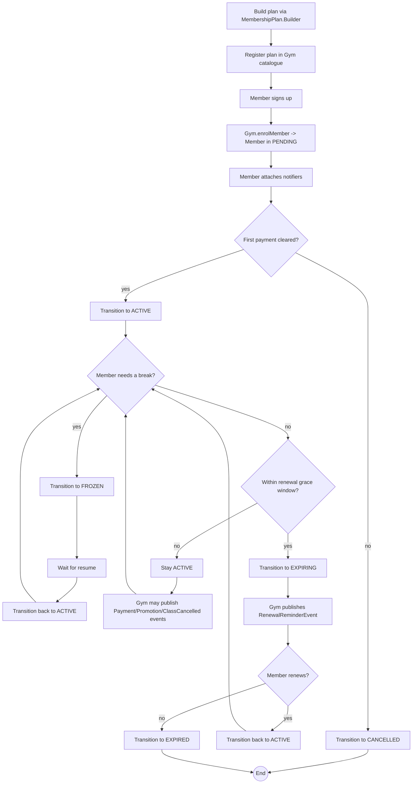

# Activity Diagram -- Member lifecycle

End-to-end workflow of a gym member, from sign-up to expiration or
cancellation. PlantUML source:
[membership-lifecycle-activity.puml](membership-lifecycle-activity.puml).

## How the activity diagram maps to the code

| Activity step | Concrete method call |
|---------------|----------------------|
| Build a plan | `new MembershipPlan.Builder(name).durationMonths(...).monthlyFee(...).build()` |
| Register a plan | `gym.registerPlan(plan)` |
| Enrol a member | `gym.enrolMember(name, email, phone, planName)` |
| Attach notifier | `member.attachNotifier(new EmailMemberNotifier(member))` |
| Activate | `member.setStatus(MembershipStatus.ACTIVE)` |
| Freeze / Resume | `member.setStatus(MembershipStatus.FROZEN)` / `MembershipStatus.ACTIVE` |
| Enter grace window | `member.setStatus(MembershipStatus.EXPIRING)` |
| Renewal reminder | `gym.publishRenewalReminder(member.getId())` |
| Renew | `member.setStatus(MembershipStatus.ACTIVE)` (renewal date is auto-pushed) |
| Expire | `member.setStatus(MembershipStatus.EXPIRED)` |
| Cancel | `member.setStatus(MembershipStatus.CANCELLED)` |

Every step is validated by `Member.setStatus(...)`; an invalid call
(e.g. jumping from `PENDING` straight to `EXPIRED`) throws
`IllegalArgumentException`.
