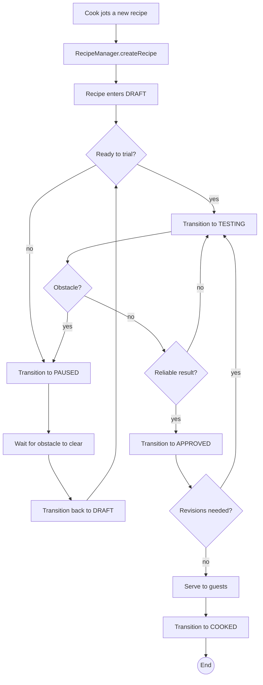

# Activity Diagram -- Recipe lifecycle

End-to-end workflow of a recipe, from the moment a cook jots it down
to the moment it is served to guests. The PlantUML source is in
[recipe-lifecycle-activity.puml](recipe-lifecycle-activity.puml).

## How the activity diagram maps to the state machine

| Activity step | Concrete method call |
|---|---|
| Jot a recipe | `manager.createRecipe(type, title, description, priority)` |
| Trial it | `manager.transitionRecipe(id, RecipeStatus.TESTING)` |
| Finalise | `manager.transitionRecipe(id, RecipeStatus.APPROVED)` |
| Revise | `manager.transitionRecipe(id, RecipeStatus.TESTING)` |
| Pause | `manager.transitionRecipe(id, RecipeStatus.PAUSED)` |
| Resume | `manager.transitionRecipe(id, RecipeStatus.DRAFT)` |
| Serve and close | `manager.transitionRecipe(id, RecipeStatus.COOKED)` |

Every step is validated by `AbstractRecipe.setStatus(...)`; an
invalid call (e.g. trying to jump from `DRAFT` straight to `COOKED`)
throws `IllegalArgumentException`.
