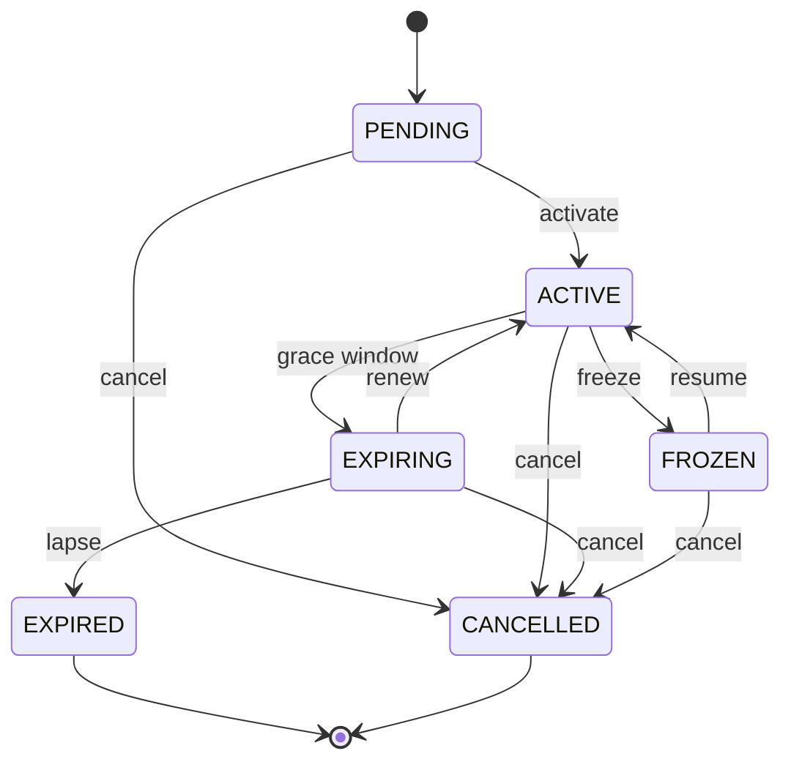

# State Diagram -- Membership lifecycle

The six `MembershipStatus` values and the allowed transitions between
them. PlantUML source: [membership-state.puml](membership-state.puml).

## Transition table

| From        | Allowed to                          | Disallowed |
|-------------|-------------------------------------|------------|
| `PENDING`   | `ACTIVE`, `CANCELLED`               | anything else |
| `ACTIVE`    | `EXPIRING`, `FROZEN`, `CANCELLED`   | anything else |
| `EXPIRING`  | `ACTIVE`, `EXPIRED`, `CANCELLED`    | anything else |
| `EXPIRED`   | (terminal)                          | every other state |
| `FROZEN`    | `ACTIVE`, `CANCELLED`               | anything else |
| `CANCELLED` | (terminal)                          | every other state |

Any disallowed transition throws `IllegalArgumentException` with the
exact message `"Cannot transition from X to Y"`. The state machine is
enforced inside `Member.setStatus(...)` via the enum method
`MembershipStatus.canTransitionTo(...)`.

When a member moves from `EXPIRING` or `FROZEN` back into `ACTIVE`,
`Member.setStatus` also pushes the renewal date forward by the plan's
duration -- modelling a renewal or a resume.
