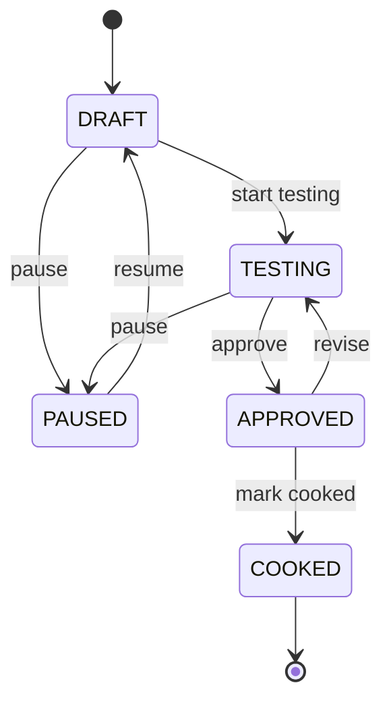

# State Diagram -- Recipe lifecycle

The five `RecipeStatus` values and the nine allowed transitions
between them. The PlantUML source is in
[recipe-state.puml](recipe-state.puml).

## Transition table

| From | Allowed to | Disallowed |
|---|---|---|
| `DRAFT` | `TESTING`, `PAUSED` | anything else |
| `TESTING` | `APPROVED`, `PAUSED` | anything else |
| `APPROVED` | `COOKED`, `TESTING` | anything else |
| `COOKED` | (terminal) | every other state |
| `PAUSED` | `DRAFT` | anything else |

Any disallowed transition throws `IllegalArgumentException` with the
exact message `"Cannot transition from X to Y"`. The state machine is
enforced inside `AbstractRecipe.setStatus(...)` via the enum method
`RecipeStatus.canTransitionTo(...)`.
