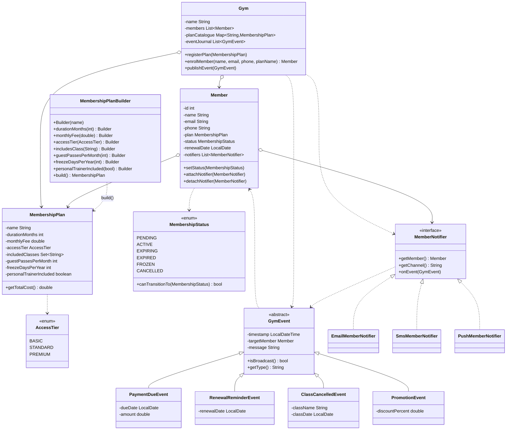

# Class Diagram

Gym Membership Management System -- 19 classes organised in three layers
(domain / pattern / coordination). The PlantUML source is in
[gym-management-class.puml](gym-management-class.puml).

## What to look at

- **Two pattern hierarchies sit side by side.** The Builder side is
  `MembershipPlan` and its nested `Builder` (drawn as
  `MembershipPlanBuilder` here because Mermaid does not render nested
  notation cleanly). The Observer side is `GymEvent` with four
  subclasses plus `MemberNotifier` with three implementations.
- **`Gym` only references abstractions.** Its fields are
  `List<Member>`, `Map<String, MembershipPlan>`, and `List<GymEvent>`
  -- never a concrete event or notifier.
- **`MembershipStatus` sits alongside `Member`** and provides the
  lightweight State pattern that enforces lifecycle transitions.
