# Class Diagram - Gym Membership Management System

This diagram captures the static structure of the rebuilt Gym Membership
Management System. Every domain type, pattern abstraction, concrete event, and
concrete observer in `src/main/java/` appears below. The visual centre of the
diagram is the `Gym` class, which acts both as the application's aggregate root
(holding members, classes, and observers) and as the Subject in the Observer
pattern. `Main` sits to the side as the single entry point that wires everything
together.

Two clusters are worth tracing on the diagram. The **Builder cluster**
(`FitnessClass` plus its nested `Builder`) shows the Creational pattern: only
the nested `Builder` can construct a `FitnessClass`, and `build()` re-validates
the combined state before returning an immutable instance. The **Observer
cluster** (`GymEvent` with six concrete events on one side, `GymEventObserver`
with three concrete observers on the other) shows the Behavioral pattern: `Gym`
publishes one event and every registered observer receives it through the
`onEvent(GymEvent)` interface.

```mermaid
classDiagram
    direction LR

    %% ----- Domain --------------------------------------------------
    class Member {
        -int id
        -String name
        -String email
        +Member(int, String, String)
        +getId() int
        +getName() String
        +getEmail() String
        +equals(Object) boolean
        +hashCode() int
    }

    class FitnessClass {
        -String name
        -String instructor
        -DayOfWeek dayOfWeek
        -LocalTime startTime
        -int durationMinutes
        -int capacity
        -String room
        -Difficulty difficulty
        -List~String~ equipment
        -String description
        -List~Member~ enrolledMembers
        +getName() String
        +getCapacity() int
        +isFull() boolean
        +hasMember(Member) boolean
        +getEnrolledMembers() List~Member~
        +getEnrolmentCount() int
        ~addMember(Member) void
        ~removeMember(Member) void
    }

    class FitnessClassBuilder {
        <<nested in FitnessClass>>
        -String name
        -String instructor
        -DayOfWeek dayOfWeek
        -LocalTime startTime
        -int durationMinutes
        -int capacity
        -String room
        -Difficulty difficulty
        -List~String~ equipment
        -String description
        +Builder(String, String)
        +dayOfWeek(DayOfWeek) Builder
        +startTime(LocalTime) Builder
        +durationMinutes(int) Builder
        +capacity(int) Builder
        +room(String) Builder
        +difficulty(Difficulty) Builder
        +addEquipment(String) Builder
        +description(String) Builder
        +build() FitnessClass
    }

    class Difficulty {
        <<enumeration>>
        BEGINNER
        INTERMEDIATE
        ADVANCED
    }

    %% ----- Subject -------------------------------------------------
    class Gym {
        <<Subject>>
        -String name
        -List~Member~ members
        -List~FitnessClass~ classes
        -List~GymEventObserver~ observers
        -int nextMemberId
        +Gym(String)
        +addObserver(GymEventObserver) void
        +removeObserver(GymEventObserver) void
        +observerCount() int
        +addMember(String, String) Member
        +removeMember(int) void
        +getMember(int) Member
        +getMembers() List~Member~
        +addClass(FitnessClass) void
        +removeClass(String) void
        +getFitnessClass(String) FitnessClass
        +getClasses() List~FitnessClass~
        +enrolMemberInClass(int, String) void
        +dropMemberFromClass(int, String) void
        -publish(GymEvent) void
    }

    %% ----- Pattern abstractions ------------------------------------
    class GymEvent {
        <<abstract>>
        #LocalDateTime timestamp
        #String type
        #String message
        #GymEvent(String, String)
        +getTimestamp() LocalDateTime
        +getType() String
        +getMessage() String
        +toString() String
    }

    class GymEventObserver {
        <<interface>>
        +onEvent(GymEvent) void
    }

    %% ----- Concrete events -----------------------------------------
    class MemberAddedEvent {
        -Member member
        +MemberAddedEvent(Member)
        +getMember() Member
    }
    class MemberRemovedEvent {
        -Member member
        +MemberRemovedEvent(Member)
        +getMember() Member
    }
    class ClassAddedEvent {
        -FitnessClass fitnessClass
        +ClassAddedEvent(FitnessClass)
        +getFitnessClass() FitnessClass
    }
    class ClassRemovedEvent {
        -FitnessClass fitnessClass
        +ClassRemovedEvent(FitnessClass)
        +getFitnessClass() FitnessClass
    }
    class MemberEnrolledInClassEvent {
        -Member member
        -FitnessClass fitnessClass
        +MemberEnrolledInClassEvent(Member, FitnessClass)
        +getMember() Member
        +getFitnessClass() FitnessClass
    }
    class MemberDroppedFromClassEvent {
        -Member member
        -FitnessClass fitnessClass
        +MemberDroppedFromClassEvent(Member, FitnessClass)
        +getMember() Member
        +getFitnessClass() FitnessClass
    }

    %% ----- Concrete observers --------------------------------------
    class ConsoleObserver {
        +onEvent(GymEvent) void
    }
    class AuditFileObserver {
        -String path
        -boolean warnedOnce
        +AuditFileObserver()
        +AuditFileObserver(String)
        +getPath() String
        +onEvent(GymEvent) void
    }
    class InMemoryJournalObserver {
        -List~GymEvent~ journal
        +onEvent(GymEvent) void
        +getJournal() List~GymEvent~
        +size() int
        +clear() void
    }

    %% ----- Entry point ---------------------------------------------
    class Main {
        +main(String[]) void
    }

    %% ----- Relationships: Gym aggregations -------------------------
    Gym "1" o-- "1..*" Member : registers
    Gym "1" o-- "1..*" FitnessClass : schedules
    Gym "1" o-- "1..*" GymEventObserver : notifies

    %% Enrolment + value link
    FitnessClass "0..*" o-- "0..*" Member : enrols
    FitnessClass --> Difficulty : has

    %% Builder creates the product (Builder is nested in FitnessClass)
    FitnessClassBuilder ..> FitnessClass : creates
    FitnessClass *-- FitnessClassBuilder : nested

    %% Event inheritance
    GymEvent <|-- MemberAddedEvent
    GymEvent <|-- MemberRemovedEvent
    GymEvent <|-- ClassAddedEvent
    GymEvent <|-- ClassRemovedEvent
    GymEvent <|-- MemberEnrolledInClassEvent
    GymEvent <|-- MemberDroppedFromClassEvent

    %% Observer implementation
    GymEventObserver <|.. ConsoleObserver
    GymEventObserver <|.. AuditFileObserver
    GymEventObserver <|.. InMemoryJournalObserver

    %% Publication
    Gym ..> GymEvent : publishes
    Gym ..> GymEventObserver : onEvent

    %% Entry point usage
    Main ..> Gym : uses
```

## Legend

- Solid arrow with hollow triangle (`<|--`) - class inheritance (concrete events extend `GymEvent`).
- Dashed arrow with hollow triangle (`<|..`) - interface implementation (concrete observers implement `GymEventObserver`).
- Open diamond (`o--`) - aggregation; the `Gym` owns the lifecycle of its members, classes, and observers.
- Filled diamond (`*--`) - composition; `FitnessClassBuilder` is `FitnessClass.Builder` in code, a static nested class of `FitnessClass`.
- Dashed arrow (`..>`) - usage dependency (Builder creates a `FitnessClass`; `Gym` publishes a `GymEvent` and dispatches to observers; `Main` drives `Gym`).
- `+` public, `-` private, `#` protected, `~` package-private. `FitnessClass.addMember` and `FitnessClass.removeMember` are package-private on purpose - only `Gym` should call them.

The PlantUML mirror of this diagram is in
[gym-management-class.puml](gym-management-class.puml).
