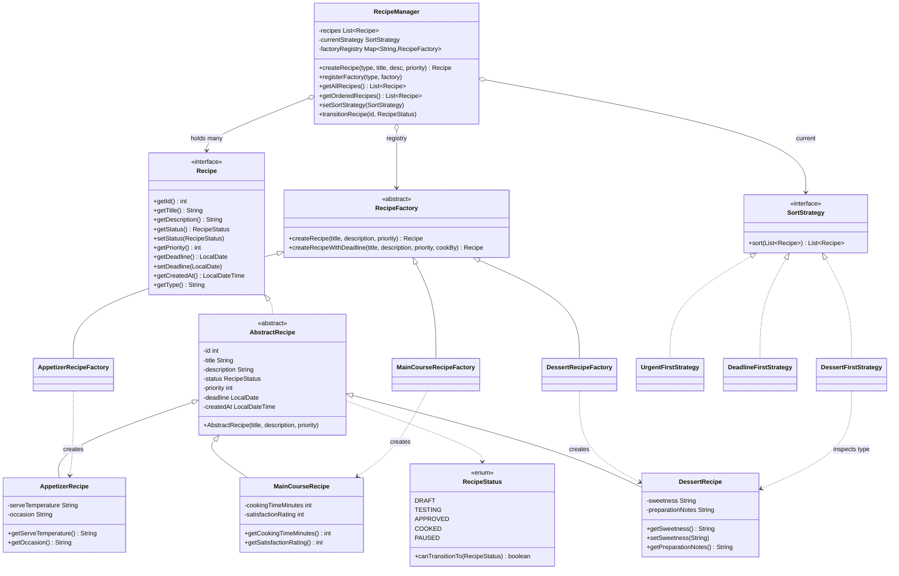

# Class Diagram

Recipe Management System -- 17 classes organised in three layers
(product / pattern / coordination). The PlantUML source is in
[recipe-management-class.puml](recipe-management-class.puml).

## What to look at

- **Two pattern hierarchies sit side by side.** `RecipeFactory` and its
  three subclasses are the Factory Method side. `SortStrategy` and its
  three implementations are the Strategy side.
- **`RecipeManager` only points at abstractions.** Its three fields are
  `List<Recipe>`, `SortStrategy`, `Map<String, RecipeFactory>` -- never
  a concrete recipe, factory, or strategy class.
- **`RecipeStatus` enum sits to the side** as a lightweight state
  machine. The dashed arrow from `AbstractRecipe` represents the
  state-transition check inside `setStatus(...)`.
