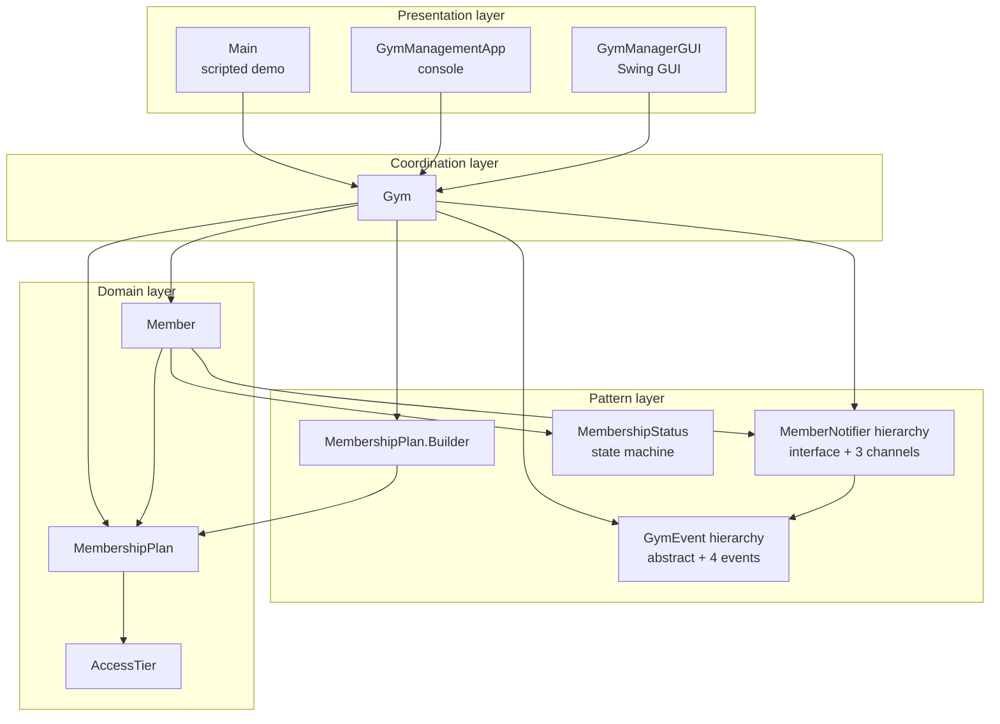

# Component Diagram

Four logical layers, all running inside one JVM. PlantUML source:
[component-diagram.puml](component-diagram.puml).

## What to look at

- Every arrow points *toward* an abstraction or the domain layer --
  never the other way round. That is the Dependency Inversion
  Principle in diagram form.
- The Presentation layer never reaches past the Coordination layer.
  Changing the GUI cannot break the engine.
- Adding a new presentation layer (e.g. a REST API) means adding one
  more box in the Presentation layer with one more arrow into the
  `Gym` -- and nothing else.
