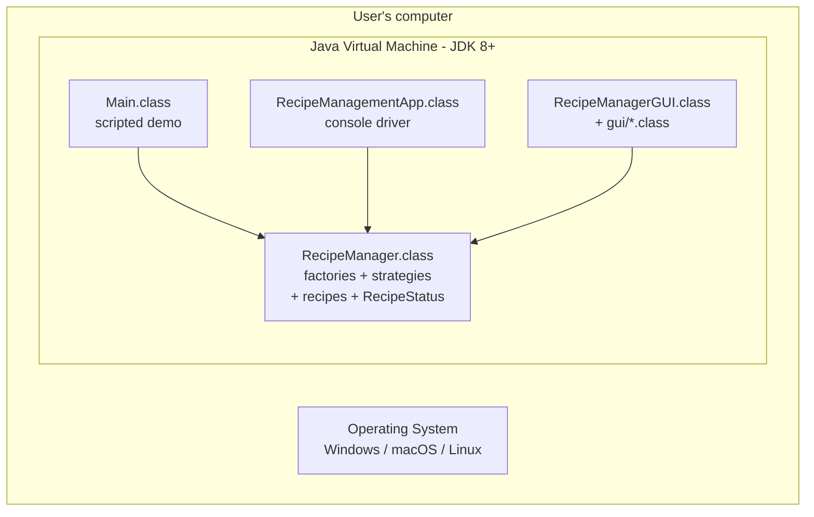

# Deployment Diagram

The whole system runs in one JVM. The PlantUML source is in
[deployment-diagram.puml](deployment-diagram.puml).

## What to look at

- One process, one JVM, zero remote dependencies. The system runs
  identically on Windows, macOS, and Linux as long as a JDK 8 or
  newer is installed.
- The three entry points are siblings; they all link the same engine
  classes. Choosing one mode does not exclude the others.
- No network connection, no database, no external service. This is
  the simplest possible deployment topology -- intentional, given
  the assignment's mandate of "pure Java with the standard library".
