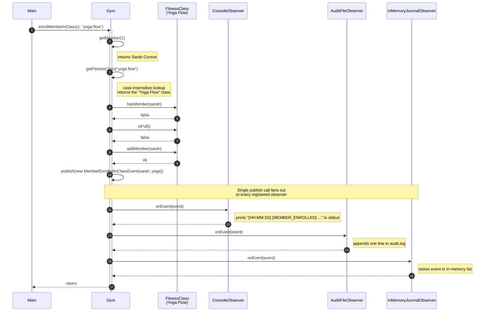

# Sequence Diagram - Enrol Member In Class

This diagram walks through a single call from `Main` into the Gym:
`gym.enrolMemberInClass(1, "yoga flow")`. It traces every interaction between
the entry point, the `Gym` Subject, the `FitnessClass` being modified, and the
three concrete observers attached during setup (`ConsoleObserver`,
`AuditFileObserver`, `InMemoryJournalObserver`). The two internal lookups
(`getMember`, `getFitnessClass`) are shown as self-messages on `Gym` because
they are private collaborations inside the same object.

The headline of the diagram is **step 7** combined with the three messages
underneath it. `Gym` calls its own private `publish(...)` exactly once, with a
single `MemberEnrolledInClassEvent`. That one publish call fans out to every
registered observer in turn - the console prints, the audit file appends, and
the in-memory journal records. This is the entire point of the Observer
pattern: one event, many side effects, zero coupling between `Gym` and any
specific reaction.

## Why this matters

- One method call on the Subject (`Gym.publish`) drives N observers without
  `Gym` knowing what they are. Add a fourth observer (e.g. a metrics emitter)
  and `Gym` does not change.
- All publication goes through the same private `publish(GymEvent)` method.
  `Member`, `FitnessClass`, and `Main` never call `onEvent` directly - so when
  you are debugging "why did this fire?", you only have to look in one place.
- The lookups in steps 2 and 3 are deliberately separate steps so the diagram
  reflects the two-stage validation that happens before any state changes
  (and before any event is published).

The PlantUML mirror of this diagram is in
[publish-event-sequence.puml](publish-event-sequence.puml).
