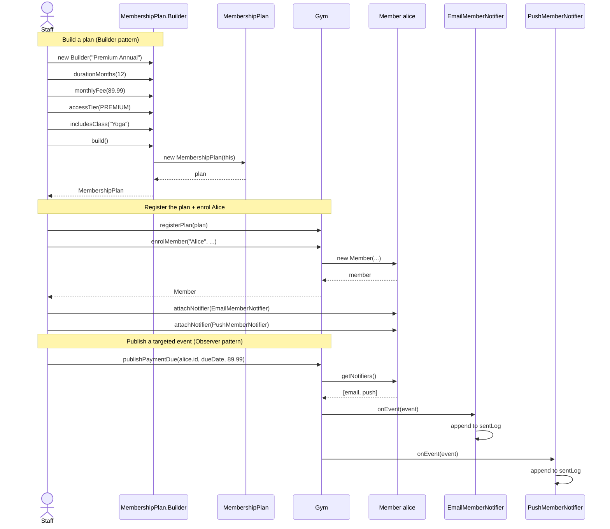

# Sequence Diagram

Two flows: building a plan via the Builder, then enrolling a member
and publishing a targeted event through the Observer fabric. PlantUML
source: [publish-event-sequence.puml](publish-event-sequence.puml).

## What to look at

- **Builder in action.** The Staff sets each attribute via a chainable
  method, then calls `build()`. The Builder validates and constructs
  the immutable `MembershipPlan`. The Staff never calls the
  `MembershipPlan` constructor directly -- it is private.
- **Observer in action.** A single `publishPaymentDue(...)` call on
  the `Gym` causes both of Alice's attached notifiers to fire. The
  `Gym` never names `EmailMemberNotifier` or `PushMemberNotifier`
  directly -- it iterates `Alice.getNotifiers()` and calls
  `onEvent(event)` polymorphically through the `MemberNotifier`
  interface.
