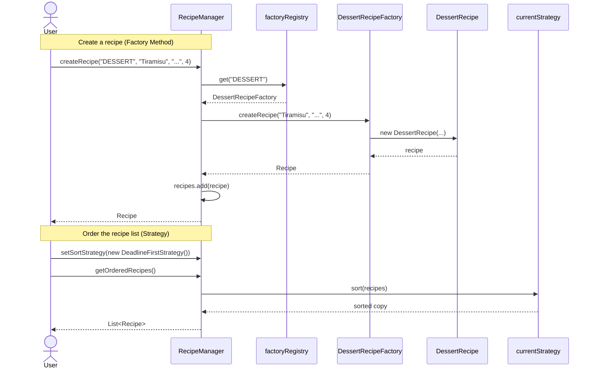

# Sequence Diagram

Two flows through the system. The PlantUML source is in
[recipe-creation-sequence.puml](recipe-creation-sequence.puml).

## What to look at

- **Factory Method in action.** Notice that the user only passes the
  string `"DESSERT"`. The manager looks up the right factory and the
  factory does the `new DessertRecipe(...)`. The user never names the
  concrete class.
- **Strategy in action.** Swapping `currentStrategy` is a single
  setter call. The next call to `getOrderedRecipes()` runs through the
  newly-installed strategy with no further plumbing.
