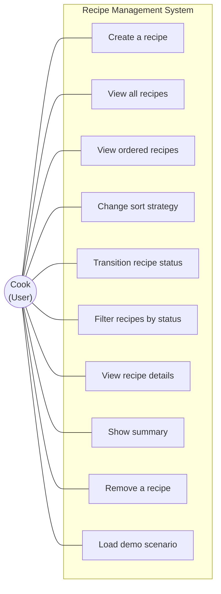

# Use Case Diagram

Every operation a cook can perform. The PlantUML source is in
[recipe-management-usecase.puml](recipe-management-usecase.puml).

## Pattern annotations

| Use case | Pattern involvement |
|---|---|
| Create a recipe | Factory Method -- the manager looks up the right factory by type key and delegates the `new` call to it. |
| View ordered recipes | Strategy -- the manager delegates ordering to the current `SortStrategy`. |
| Change sort strategy | Strategy swap -- a single setter call replaces the algorithm at runtime. |
| Transition recipe status | State -- validated by the `RecipeStatus` enum's transition rules. |
| Load demo scenario | GUI helper -- the `DemoScenarios` class mirrors the data sets used in the scripted tests. |

Every use case is reachable from all three entry points (`Main`,
`RecipeManagementApp`, `gui/RecipeManagerGUI`) because all three drive
the same `RecipeManager` public API.
