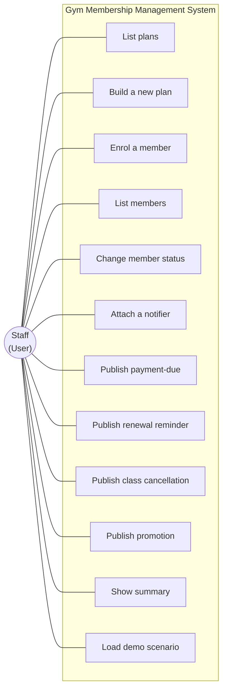

# Use Case Diagram

Every operation the staff can perform. PlantUML source:
[gym-management-usecase.puml](gym-management-usecase.puml).

## Pattern annotations

| Use case | Pattern involvement |
|----------|---------------------|
| Build a new plan | Builder -- the fluent inner class composes plan attributes and validates them in `build()`. |
| Enrol a member | Gym consumes the registered plan (built earlier via the Builder) and creates a `Member` in `PENDING`. |
| Change member status | State -- validated by the `MembershipStatus` enum's transition rules. |
| Attach a notifier | Observer -- adds an Observer to the member's local subscription list. |
| Publish payment-due / renewal reminder | Targeted Observer dispatch -- only that member's notifiers fire. |
| Publish class cancellation / promotion | Broadcast Observer dispatch -- every notifier on every member fires. |
| Load demo scenario | GUI helper -- `DemoScenarios` mirrors the data sets used in the scripted tests. |

Every use case is reachable from all three entry points (`Main`,
`GymManagementApp`, `gui.GymManagerGUI`) because all three drive the
same `Gym` public API.
